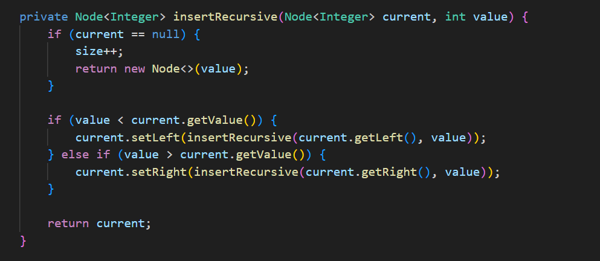
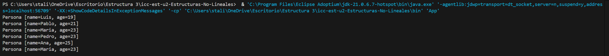
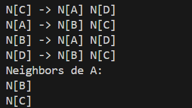
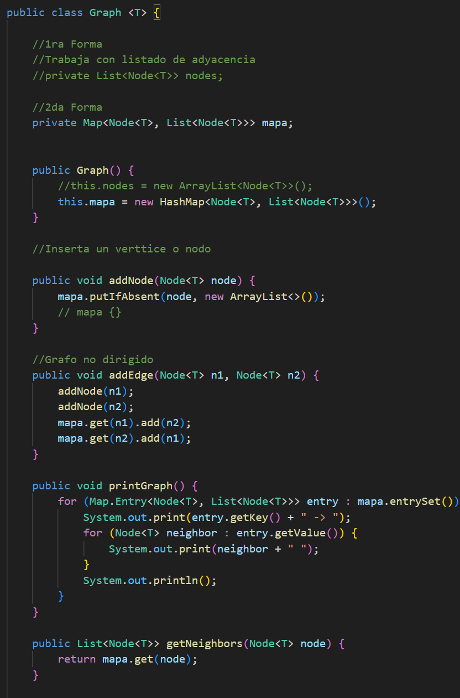

# Práctica: Estructuras No Lineales - 

## Autor
- Nombre: Javier Barrezueta
- Carrera/Curso: Estructura de Datos 

##  Nombre de la práctica - Fecha
- Práctica: 
- Fecha: 5-1-2026

## Descripción
Descripción de que es lo que hizo o alcanzo desarrollar en la práctica.

En el archivo IntTree.java se implementó la funcionalidad para calcular el tamaño del árbol basándose en la imagen de la pizarra, añadiendo un método público size() que inicia el proceso y un método privado sizeRecursive(Node node) que realiza el conteo real; este último utiliza recursividad para recorrer la estructura, retornando 0 si encuentra un nodo nulo o la suma de 1 (el nodo actual) más los resultados obtenidos de sus subárboles izquierdo y derecho para devolver el total de elementos existentes.

## Evidencias
### Captura 1
Inserta aquí la captura del código o de la ejecución.
- Archivo: `assets/captura-1.png`

### Captura 2 
Inserta aquí una segunda captura si aplica.
- Archivo: `assets/captura-2.png`

##  Nombre de la práctica - Fecha
- Práctica: Práctica de Árboles – Interface Comparable
- Fecha: 6-1-2026

### Captura 3
Inserta aquí la captura del código o de la ejecución.

### Captura 4 

##  Nombre de la práctica - Fecha
- Práctica: Graphs
- Fecha: 8-1-2026

## Descripción
Se desarrolló la implementación de estructuras de datos no lineales, específicamente Grafos y Árboles Binarios, utilizando programación genérica en Java para manipular distintos tipos de datos. Para el grafo, se aplicó un enfoque de lista de adyacencia mediante HashMap, permitiendo la conexión de nodos y la recuperación eficiente de sus vecinos inmediatos. En cuanto a los árboles, se programaron algoritmos recursivos para la inserción, el cálculo del tamaño y los recorridos principales (PreOrder, InOrder, PostOrder). Finalmente, se integraron y validaron ambas estructuras en la clase App, demostrando la correcta gestión de vértices, aristas y la búsqueda de información dentro de la jerarquía.

## Evidencias
### Captura 1
Inserta aquí la captura del código o de la ejecución.
- Archivo: `assets/captura-1.png`

### Captura 2 
Inserta aquí una segunda captura si aplica.

Clase graph

