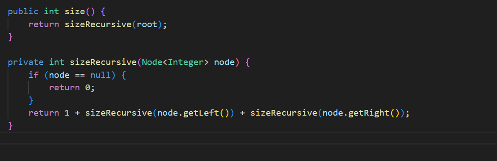

# Práctica: Estructuras No Lineales - 

## Autor
- Nombre: Javier Barrezueta
- Carrera/Curso: Estructura de Datos 

##  Nombre de la práctica - Fecha
- Práctica: [Nombre exacto de la práctica]
- Fecha: 5-1-2026

## Descripción
Descripción de que es lo que hizo o alcanzo desarrollar en la práctica.

En el archivo IntTree.java se implementó la funcionalidad para calcular el tamaño del árbol basándose en la imagen de la pizarra, añadiendo un método público size() que inicia el proceso y un método privado sizeRecursive(Node node) que realiza el conteo real; este último utiliza recursividad para recorrer la estructura, retornando 0 si encuentra un nodo nulo o la suma de 1 (el nodo actual) más los resultados obtenidos de sus subárboles izquierdo y derecho para devolver el total de elementos existentes.

## Evidencias
### Captura 1
Inserta aquí la captura del código o de la ejecución.
- Archivo: `assets/captura-1.png`

### Captura 2 
Inserta aquí una segunda captura si aplica.
- Archivo: `assets/captura-2.png`

